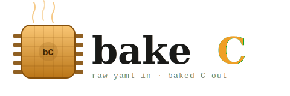

# bakeC




> **Raw YAML in. Baked C out.**

MATLAB Embedded Coder costs somewhere between "a lot" and "why does this exist". bakeC doesn't.

It does the same job — YAML model in, production-quality embedded C out — for free, in the open, and without a license server. `init`/`step`/`terminate` lifecycle, MISRA C:2012 compliance, Cortex-M4 and AURIX targets, full traceability. The whole pipeline, reimplemented from scratch so it's no longer a black box.

Is it a drop-in replacement for Embedded Coder? No. Is it a complete, documented, tested reimplementation that proves the toolchain isn't magic? Yes.

---

## What it actually does

You give bakeC a YAML model and a platform config. It gives you four C files per model:

| File | What's in it |
|---|---|
| `{name}_controller.h` | Public API: I/O structs, lifecycle prototypes |
| `{name}_controller.c` | The algorithm: init/step/terminate |
| `{name}_controller_data.c` | Calibration data (swap it without touching the algorithm) |
| `{name}_controller_types.h` | Platform-specific typedefs |

Then it runs 36 automated checks against the output — MISRA, traceability, safety patterns, regression, API stability — and tells you if anything is wrong. All without a compiler.

```
$ python -m bakec.cli validate --target generated/desktop/

bakeC v0.1.0

Target:    generated/desktop/

Running checks...

  OK -- All checks passed
```

Every design decision maps directly to its Embedded Coder equivalent. The struct-based I/O pattern, the init/step/terminate lifecycle, the calibration data split — it's all documented in the [TLC mapping](docs/tlc-mapping.md) and [automotive mapping](docs/automotive-mapping.md). No magic, no vendor lock-in, no five-figure invoice.

---

## Prerequisites

- Python 3.10+

Want to actually compile the generated C (optional but satisfying)?

- **Linux/macOS:** GCC and CMake (almost certainly already installed)
- **Windows:** [MSYS2](https://www.msys2.org/) with MinGW-w64 — `pacman -S mingw-w64-x86_64-gcc mingw-w64-x86_64-cmake`

Cross-compilation toolchains (ARM, AURIX) are intentionally not required. More on that below.

---

## Quick start

```bash
git clone https://github.com/manju89jay/bakeC.git
cd bakeC
pip install -e ".[dev]"    # bakec + pytest + coverage
make all                    # generate → compile → test → validate
```

`make all` runs the full pipeline: generates C for all 9 model x platform combinations, compiles the desktop target with GCC, runs 172 Python tests + 3 C executables, and validates against all 36 checks.

No GCC? The Python-only commands still work:

```bash
# Generate C for one model + platform
python -m bakec.cli generate \
  --model models/lung_mnarx.yaml \
  --platform platforms/desktop.yaml \
  --output generated/desktop/

# Validate (no compiler needed)
python -m bakec.cli validate --target generated/desktop/

# Run the Python test suite
python -m pytest tests/ -v
```

---

## Architecture

Two command paths. No surprises.

**Generate:** YAML model + platform → Parser → Validator → Jinja2 engine → C files

**Validate:** C files [+ baseline] → MISRA + traceability + safety + regression checks → report

```
src/bakec/
  parser.py          YAML → Python dict  (the .rtw equivalent, without the mystery)
  validator.py       Semantic checks on model IR
  engine.py          Jinja2 template rendering  (TLC, but readable)
  writer.py          File output with metadata
  cli.py             generate and validate subcommands
  checks/
    runner.py        Check orchestrator
    misra.py         10 MISRA C:2012 rules
    traceability.py  5 provenance/trace checks
    safety.py        6 embedded safety patterns
    regression.py    9 structural comparison checks
    api_stability.py 6 API contract checks
    rules.yaml       Check configuration
```

Full system design with C4 diagrams in [docs/architecture.md](docs/architecture.md).

---

## Models

- **mNARX Lung** (`models/lung_mnarx.yaml`) — Modified nonlinear autoregressive lung mechanics model with pressure-dependent B-spline basis functions. Based on [Jayaramaiah et al. (2016)](https://www.scirp.org/journal/paperinformation?paperid=70763), developed during the author's master thesis. Not your average blinky LED. See [model background](docs/model_background.md).

- **PID Controller** (`models/pid_controller.yaml`) — PID pressure controller for hydraulic valve systems. The one everyone knows but few people generate correctly under MISRA.

- **Lookup Table 1D** (`models/lookup_table_1d.yaml`) — Thermistor NTC temperature sensor with 8-breakpoint piecewise linear interpolation and clamped extrapolation. The kind of thing that lives in every engine management unit on the planet.

---

## Platforms

Three targets. Two of them you can't compile locally, and that's fine — that's how production embedded CI actually works.

| Platform | Compiler | Precision | Notes |
|---|---|---|---|
| **Desktop** | GCC | `double` | Assertions on, `-O2`, compiles locally |
| **ARM Cortex-M4** | `arm-none-eabi-gcc` | `float` | `-Os`, cross-compiled in CI |
| **AURIX TC397** | `tricore-elf-gcc` | `float` | SIL 2 / PLd, EtherCAT, `-Os` |

Cross-compilation targets are generated and validated in CI but not compiled locally — cross-compilers aren't required. The generated C is correct regardless; your target build system handles compilation. This is industry-standard practice, not a limitation.

---

## Validation checks

36 checks. Zero hand-waving.

| Category | Count | What it's checking |
|---|---|---|
| MISRA C:2012 | 10 | Per-file static analysis |
| Traceability | 5 | Provenance, `@trace` tags, hashes |
| Safety | 6 | Static allocation, bounded loops, typed vars |
| Regression | 9 | Structural comparison against baseline |
| API stability | 6 | Header contract verification |

Run them independently at any time with `python -m bakec.cli validate --target <dir>`.

---

## Development

All the Makefile targets, documented honestly:

| Target | What it does | Needs |
|---|---|---|
| `make install` | Install bakec + dev deps | Python |
| `make generate` | Generate C for all 9 combos | Python |
| `make validate` | Run all 36 checks | Python |
| `make test` | Python tests (172) + C tests (3) | Python + GCC |
| `make build` | Compile desktop target | GCC + CMake |
| `make all` | Everything, in order | Python + GCC + CMake |

---

## Documentation

- [Architecture](docs/architecture.md) — C4 diagrams, system design
- [TLC Mapping](docs/tlc-mapping.md) — what each Jinja2 template replaces in TLC
- [Automotive Mapping](docs/automotive-mapping.md) — AUTOSAR concept parallels
- [Simulink Comparison](docs/simulink-comparison.md) — Embedded Coder feature mapping
- [Safety Context](docs/safety-context.md) — IEC 61508, ISO 13849-1, MISRA rationale
- [Model Background](docs/model_background.md) — the mNARX lung mechanics model
- [Architecture Decision Records](docs/decisions/) — 6 ADRs explaining the non-obvious choices
- [Adding a Model](docs/adding-a-model.md) — step-by-step guide

---

## License

MIT. Use it, fork it, embed it in something that actually ships to hardware.
